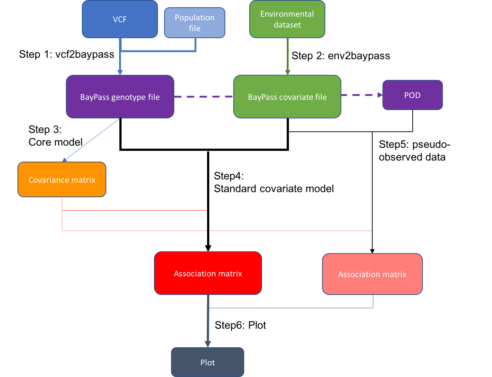
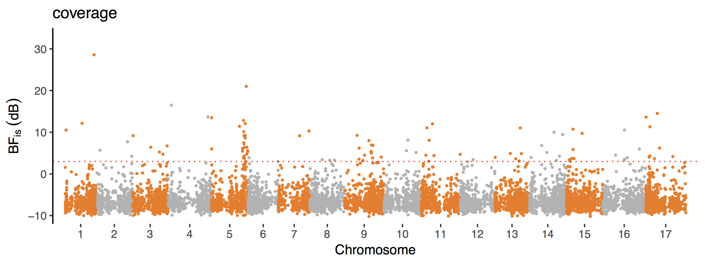
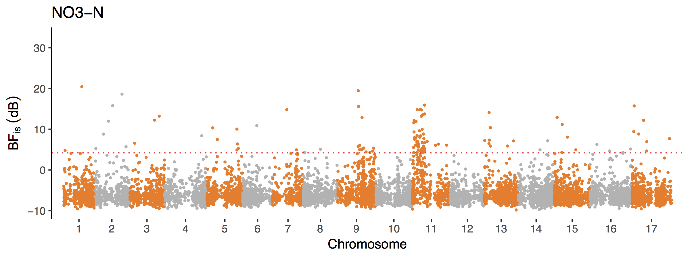

[](http://www.gnu.org/licenses/gpl-3.0)

# Genome-environment association analysis with BayPass

This repository is made for eBook entitled “Bioinformatics Recipes for Plant Genomics: Data, Code, and Workflows” in [Bio-101](https://cn.bio-protocol.org/bio101/default.aspx)

## Overview of an example workflow: Fastq data quality checking

This is an example workflow to analyze associations of environmental variables with SNP data using BayPass. 



## Installation

- __Running environment__: 
    - The workflow was constructed based on __Linux CentOS__ 7.7.1908 with the compiler gfortran (GCC) 4.8.5.

- __Required software and versions__: 

    - [perl](http://www.perl.org/) (v5.16.3)
    - [BayPass](http://www1.montpellier.inra.fr/CBGP/software/baypass/) (version 2.3)
    - [R](https://www.r-project.org/) (version 3.6.2)
    - [RStudio](https://rstudio.com/) (version 1.1.463)
    - [tidyverse](https://www.tidyverse.org) (version 1.3.0)
    - [corrplot](https://github.com/taiyun/corrplot) (version 0.84)
    - [mvtnorm](http://mvtnorm.R-forge.R-project.org) (version 1.1-1)
    - [qqman](https://www.rdocumentation.org/packages/qqman) (version 0.1.8)

To download and compile BayPass
```
cd program/
wget http://www1.montpellier.inra.fr/CBGP/software/baypass/files/baypass_2.3.tar.gz
tar -zxvf baypass_2.3.tar.gz
cd baypass_2.3/sources/
make clean all FC=gfortran
# make clean all FC=ifort # if you use the Intel ifort Fortran compiler
g_baypass -help # check
# i_baypass -help # if you use the Intel ifort Fortran compiler
cd ..
```

The R packages can be installed simply using `install.packages()` in the R or Rstudio environment:
```
install.packages("tidyverse")
install.packages("corrplot")
install.packages("mvtnorm")
install.packages("qqman")
```


## Input Data

1. VCF
The first input file `input/GSD_RAD.vcf.gz` is a Variant Call Format (VCF) file that contains the genotypes at all markers for all samples, which will be used to generate the genotyping data file for BayPass. 
VCF is commonly used to represent variation calls. It contains meta-information lines (beginning with `##` string), a header line (beginning with `#`), and then data lines. 
Each data line contains information about a locus in the reference genome, including the position and genotype information on samples for each position.
Specification of the VCF format can be found [here](https://gatk.broadinstitute.org/hc/en-us/articles/360035531692-VCF-Variant-Call-Format) or [here](https://samtools.github.io/hts-specs/VCFv4.2.pdf). 
You can get this file for your samples from most variant calling pipelines with high-throughput sequencing technology.
Here The file has been compressed to save space and therefore has the `.gz` suffix.
You can view the file by `zcat input/GSD_RAD.vcf.gz | less -S`.

2. Population information
The file `input/pop_info.tsv` contains the popultion assignment for each sample in the VCF, which will be used in generating the genotyping data file.
This is a tab-delimited file consisting of two columns: the first column contains the sample names, and the second one contains the population names. 
The first ten rows of the file:
```
1003	1003
1009	1003
1010	1003
1011	1003
1013	1003
1034	1033
1035	1033
1039	1033
1042	1033
1043	1033
```
Samples 1003, 1009, 1010, 1011 and 1013 are from population 1003, and 1034 , 1035, 1039, 1042 and 1043 are from population 1033. Each population has 5 individuals.

3. Environmental dataset
The environmental dataset `input/GSD_env.tsv` is a tab-delimited file that records environmental data for each population.
The first column gives population names that are consistent with those in `input/pop_info.tsv`. 
Each of the following columns contains values of an environmental variable.
The first five rows of the example data:
```
Population      coverage        NO3-N
970     0.635670404     90
1003    0.39769942      6.855737705
1033    0.22551341      8.267213115
1063    0.6198923       43.35245902
```


## Major steps

#### Step 1:  generate the genotyping data file from VCF
```
zcat input/GSD_RAD.vcf.gz | perl script/vcf2baypass.pl input/pop_info.tsv cache/GSD_RAD.baypass
```
This step will generate 3 files in `cache/` with the `GSD_RAD.baypass` prefix. The main file `cache/GSD_RAD.baypass.txt` is the one required by BayPass. 
Two other files `cache/GSD_RAD.baypass.pop` and `cache/GSD_RAD.baypass.snp` record the order of populations and locations of SNPs, respectively, and will be used in the following steps. 
Check if the numbers of populations and SNPs are correct: 
```
wc -l cache/GSD_RAD.baypass.pop # number of populations, which should be 20 in this case
wc -l cache/GSD_RAD.baypass.txt # number of SNPs, which should be 8383
wc -l cache/GSD_RAD.baypass.txt # number of SNPs as well
```

#### Step 2: generate the covariate data file from environmental dataset
```
cat input/GSD_env.tsv | perl script/env2baypass.pl cache/GSD_RAD.baypass.pop cache/GSD_env.baypass
```
The output covariate data file `cache/GSD_env.baypass.txt` contains the values of the environmental variables for each population in the format required by BayPass.
The associated file `cache/GSD_env.baypass.cov` records the names of the covariates, which will be used for plotting.

#### Step 3: run BayPass under the core model mode to generate covariance matrix
```
npop=$(wc -l cache/GSD_RAD.baypass.pop | cut -d " " -f1)
program/baypass_2.3/sources/g_baypass -npop $npop -gfile cache/GSD_RAD.baypass.txt -outprefix cache/GSD_RAD_core -nthreads 40
```
The parameter `-npop` specifies the number of population. In this case, the number is counted automatically from the output in previous step. 
The parameter `-nthreads` gives the number of threads to be used for parallel computations. The example data take less than 10min with 40 threads.
The `-outprefix` gives the prefix for output files. Multiple files will be generated by this command, but the `*_mat_omega.out` is what we need for the next step.
The covariance matrix can be visualized using `corrplot.R`:
```
Rscript script/corrplot.R
```
This will generate `output/GSD_RAD_core_mat_omega.png`.

#### Step 4: run BayPass under the standard covariate model using importance sampling (IS) estimator
```
program/baypass_2.3/sources/g_baypass -npop 20 -gfile cache/GSD_RAD.baypass.txt -efile cache/GSD_env.baypass.txt -scalecov -omegafile cache/GSD_RAD_core_mat_omega.out -outprefix cache/GSD_RAD_standard -nthreads 40
```
The `-scalecov` option asks the program to scale each covariable in the covariate data file.
The scaled values of the covariates can be found in `cache/GSD_RAD_standard_covariate.std`.
This command takes less than 10min with 40 threads. 

#### Step 5: produce a pseudo-observed data (POD) sample with 1,000 SNPs and run BayPass
```
Rscript script/POD.R
```
This will generate the file `cache/GSD_RAD_POD.baypass.txt` that has the same foramt as the genotyping data file.
You can check the number of SNPs `wc -l cache/GSD_RAD_POD.baypass.txt`, which should be 1000 in the simulated POD sample.
Then run BayPass as in Step 4 using the 1,000 simulated SNPs:
```
program/baypass_2.3/sources/g_baypass -npop 20 -gfile cache/GSD_RAD_POD.baypass.txt -efile cache/GSD_env.baypass.txt -scalecov -omegafile cache/GSD_RAD_core_mat_omega.out -outprefix cache/GSD_RAD_POD_standard -nthreads 40
```

#### Step 6: plot the results
```
Rscript script/BayPass_plot.R
```

## Expected results





## License
It is a free and open source software, licensed under [GPLv3](https://github.com/github/choosealicense.com/blob/gh-pages/_licenses/gpl-3.0.txt).
